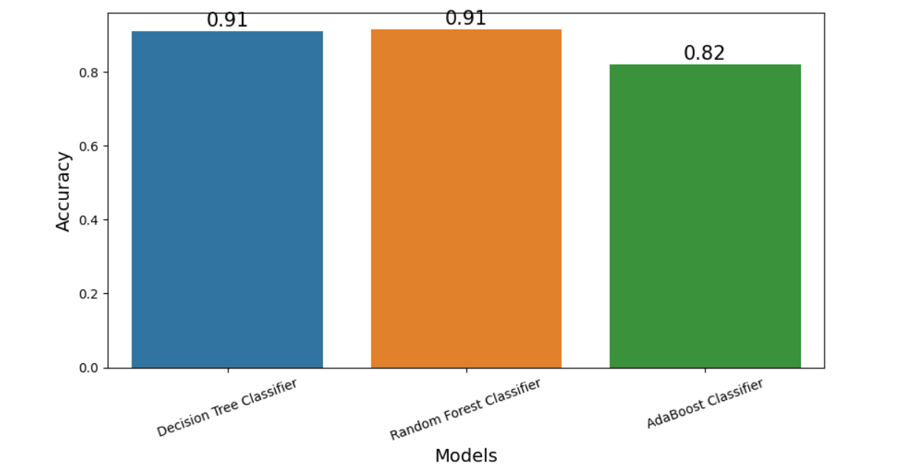

# Malicious URL Detection using Manual Feature Extraction and Model Training

## Description

This mini project focuses on the detection of malicious URLs using machine learning techniques. The project involves a two-step process: manual feature extraction and model training.

### Manual Feature Extraction

In this phase, relevant features from the URLs are manually extracted. These features may include domain length, presence of special characters, frequency of certain keywords, and other characteristics that are indicative of malicious intent. The goal is to create a comprehensive set of features that can effectively capture the distinguishing patterns in malicious URLs.

### Preprocessing

After feature extraction, the dataset is preprocessed to ensure that the data is in a suitable format for training machine learning models. This may involve handling missing values, encoding categorical variables, and scaling numerical features. Proper preprocessing enhances the quality of input data and contributes to the effectiveness of the models.

### Model Training

Three machine learning models are evaluated for this task:

- **Decision Tree Classifier (DecisionTreeClassifier)**
- **Random Forest Classifier (RandomForestClassifier)**
- **AdaBoost Classifier (AdaBoostClassifier)**

These models are trained using the preprocessed data. They learn to distinguish between malicious and benign URLs based on the features extracted earlier.

### Evaluation

The trained models are evaluated using metrics such as accuracy, precision, recall, and F1 score to assess their performance in detecting malicious URLs. The following chart illustrates the accuracy of the models:

### Deployment

Once a satisfactory model is identified, it can be deployed for real-time detection of malicious URLs. The model can be integrated into security systems to enhance the protection against cyber threats.

By combining manual feature extraction with machine learning techniques and comparing different classifiers, this mini project aims to develop a robust and accurate system for the detection of malicious URLs, contributing to the field of cybersecurity.
